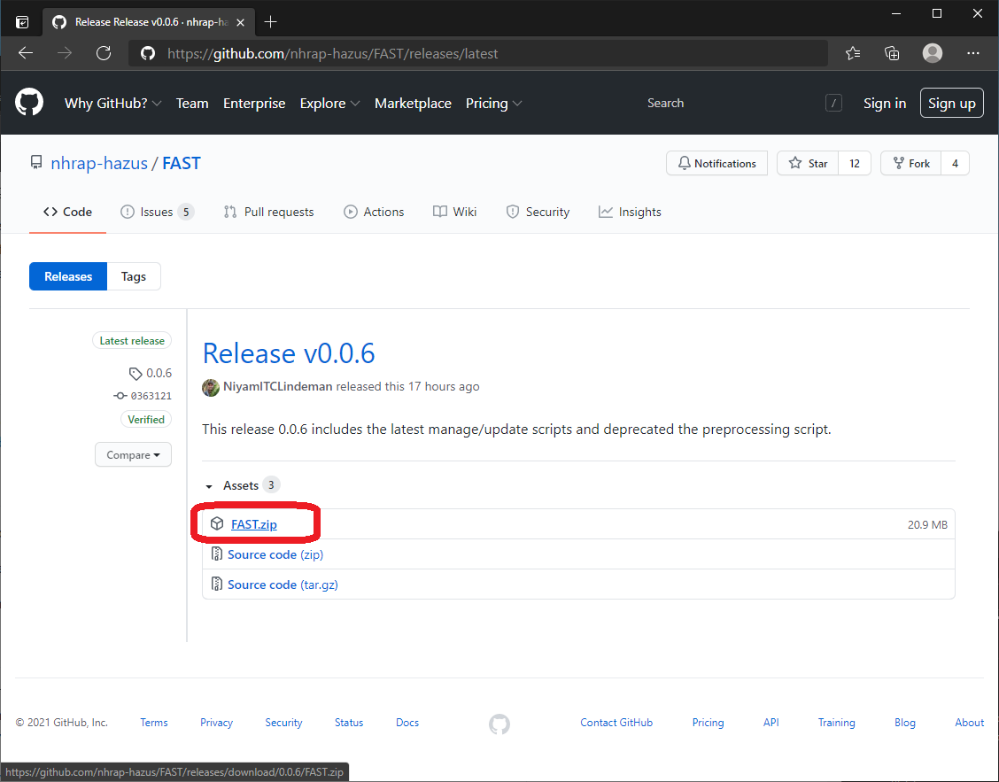
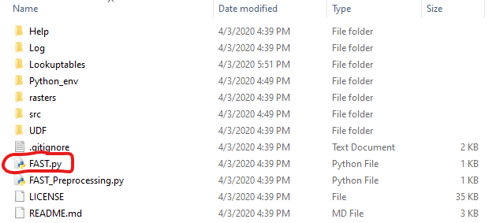

# Hazus Flood Assessment Structure Tool

The Hazus Flood Assessment Structure Tool (FAST) calculates building-level flood impacts with user-provided building and flood depth data. FAST uses the Hazus Flood model methodology to assign depth damage functions to buildings according to their occupancy type, first floor elevation, foundation type, and number of stories. Flood depth is then extracted at every building and used as a depth damage function parameter to calculate flood losses in dollars. Flood-generated debris is estimated using building area in square feet. Please refer to the [Hazus Flood Technical Manual](https://www.fema.gov/sites/default/files/2020-09/fema_hazus_flood-model_technical-manual_2.1.pdf) for more information about how FAST calculates flood impacts.

Building data must be formatted as a .csv file according to the specifications outlined here: https://github.com/nhrap-hazus/FAST/blob/master/Help/FASTBuildingData.pdf Flood depth data must be formatted as a .tiff raster. Sample building data for Honolulu, HI are included in the "UDF" folder.

FAST is developed using the Hazus Python Package. The tool automatically checks for updates each time it runs. The Hazus Team would like to thank the Oregon Department of Geology and Mineral Industries for developing an early version of this tool: https://www.oregongeology.org/pubs/ofr/O-18-04/O-18-04_user_guide.pdf

## Requirements

The Flood Assessment Structure Tool requires conda be installed on your computer. Follow the [README](https://github.com/nhrap-dev/Environment-Setup/tree/update-README) to setup your machine with miniforge and conda before running FAST
 
## Documentation

Please see the Help folder for building data guidance, FAST case study information (coming soon), and a brief video demonstration of FAST: https://github.com/nhrap-hazus/FAST/tree/master/Help

## To Use

Follow the steps below to run FAST.

**1. Download zip folder from GitHub, unzip.**

**2. Place your formatted building data in the "UDF" subfolder. Place your flood depth data in the "Rasters" subfolder.
Guidance for formatting building data can be found here: https://github.com/nhrap-hazus/FAST/blob/master/Help/FASTBuildingData.pdf***

**3. Double-click "FAST.py" If you don't have the Hazus Python Library installed, follow the prompt to install, then double-click "FAST.py" again.**

To customize the damage functions used by FAST to calculate losses, review these guidelines: https://github.com/nhrap-hazus/FAST/blob/master/Help/FASTDamageFunctions.pdf

**4. Click "Browse to Inventory Input (.csv)" to select your formatted building data.**

**5. Select "Riverine", "CoastalA", or "CoastalV" from the "Coastal Flooding Attribute" window according to your analysis requirements. Select a flood depth dataset from the "Depth Grid" window.**

**6. Click "Execute". Review the summary window after FAST finishes to confirm data were analyzed.**

## Troubleshooting

Please reach out to the Hazus Team any time for help troubleshooting tool issues at fema-hazus-support@fema.dhs.gov.

Install and Uninstall directions can be found [here](https://github.com/nhrap-dev/Environment-Setup/tree/update-README).

**For FAST versions 0.0.7 and below**
These versions use Anaconda for the Python environment. It is recommended to update to the latest tool version by uninstalling Anaconda and installing Miniforge and Conda and then downloading the latest version of the tool. Refer to the instructions [here](https://github.com/nhrap-dev/Environment-Setup/tree/update-README) to perform the uninstall.

## Contact

Check out the [Troubleshooting](#troubleshooting) section below for help operating FAST.

Issues can be reported through the repository on GitHub: https://github.com/nhrap-hazus/FAST/issues

For questions: contact the Hazus Team at fema-hazus-support@fema.dhs.gov.
